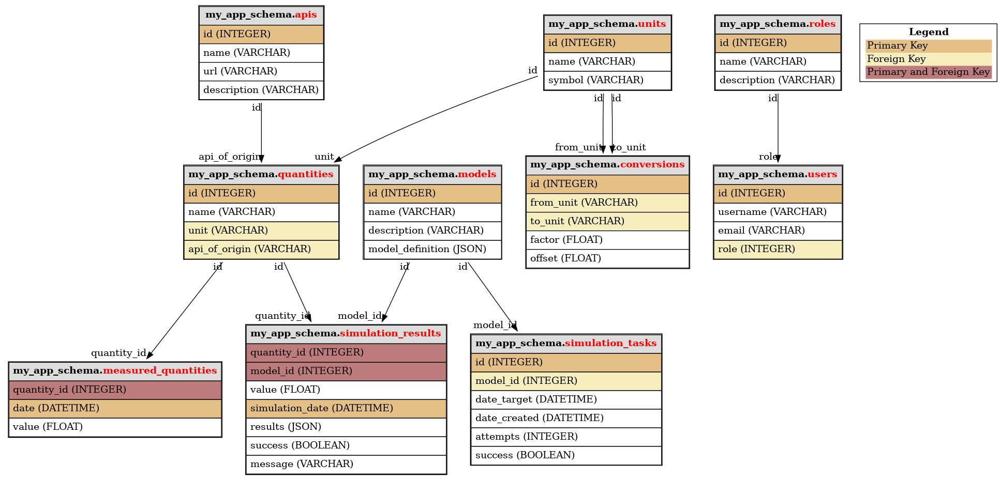
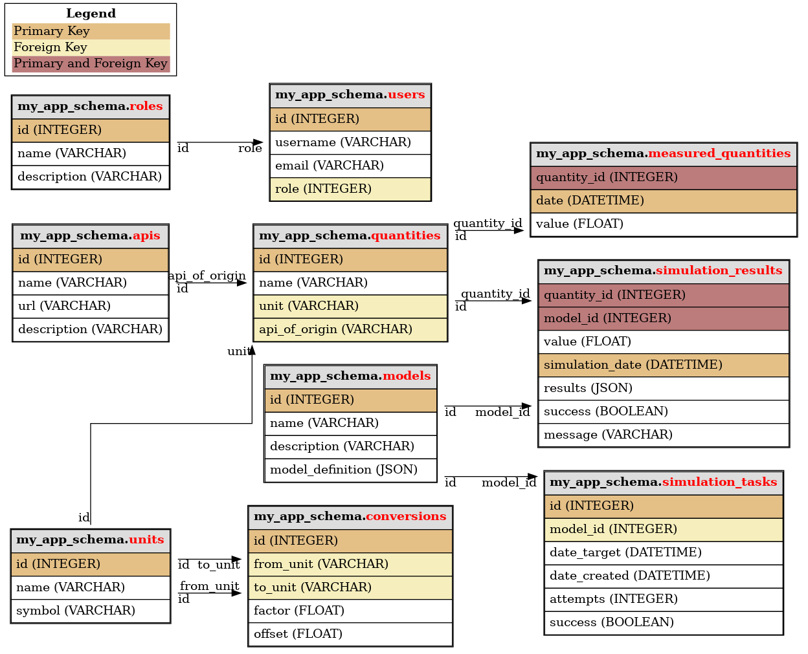

# Sqlalchemy DB graphing tool

A module to display sqlalchemy database tables and keys as a graph.


license: MIT license

## Features

Generate graphs from your sqlalchemy declarative database in one simple function call.

How to use:

```python
from sqlalchemy_db_graphing.graph import generate_graph_as_png
from mymodule.database_schema import MySQLAlchemySchema

filename = "path/to/save/file.png"
generate_graph_as_png(metadata=MySQLAlchemySchema.metadata, filename=filename)
```


`generate_graph_as_png` also supports basic arguments:
- `pk_color`: color of primary keys.
- `fk_color`: color of foreign keys.
- `pk_and_fk_color`: color of columns that are both a primary and a foreign key.
- `display_legend`: whether the legend is displayed or not.

Finally, it supports all graphviz arguments, see https://graphviz.org/docs/graph/ for a comprehensive list.

Extra example:
```
generate_graph_as_png(
        metadata=MySQLAlchemySchema.metadata,
        filename=filename,
        display_legend=True,
        rankdir="LR",  # Draw the graph from Left to Right instead of Top Down.
        splines = "ortho",
)
```


The module also includes two other functions:
- `generate_graph_as_svg` for svg pictures generation.
- `generate_graph_as_pydot` to get a pydot representation of your declarative base.

## Credits

This package was created with Cookiecutter and the `audreyr/cookiecutter-pypackage` project template.

- Cookiecutter: https://github.com/audreyr/cookiecutter
- `audreyr/cookiecutter-pypackage`: https://github.com/audreyr/cookiecutter-pypackage
